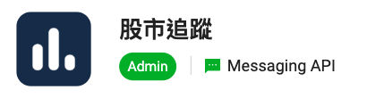
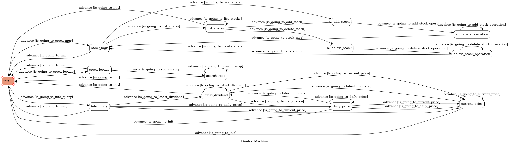

# Taiwan Stock Tracker - TOC Project Fall 2022


## Table of Contents <!-- omit in toc -->
- [Features](#features)
- [Technique](#technique)
- [Finite State Machine in the Linebot](#finite-state-machine-in-the-linebot)
- [Deployment](#deployment)
- [Repository Structure](#repository-structure)
- [Reference](#reference)

## Features
- Collect stocks : add, delete, and check the list.
- Look up the name of a stock by its ID and vice versa.
- Check the current price, daily trading statistics, and the latest ex-dividend information about the collected stocks.
- Support multi-user execution.

## Technique
- Line Bot Server : [LINE Messaging API](https://developers.line.biz/en/docs/messaging-api/overview/) based on [Flask](https://flask.palletsprojects.com/).
- Finite State Machine : based on [pytransitions](https://github.com/pytransitions/transitions).
- Web API : [TWSE Open API](https://openapi.twse.com.tw/) and [FinMind](https://finmind.github.io/).
- Database : [SQLite](https://www.sqlite.org/index.html) with [Flask-SQLAlchemy](https://flask-sqlalchemy.palletsprojects.com/).
- Docker : Simplify the deployment procedure with [Docker](https://docs.docker.com/) images and [Docker Compose](https://docs.docker.com/compose/).

## Finite State Machine in the Linebot


## Deployment
1. Clone this repository.
    ```shell
    $ git clone https://github.com/Jench2103/tw-stock-linebot.git
    $ cd tw-stock-linebot
    ```
2. Create your own `config.json` and fill the parameters.
    ```shell
    $ cd /path/to/tw-stock-linebot
    $ cp config.example.json config.json
    ```
3. Execute the server with [Docker Compose](https://docs.docker.com/compose/). The server will be running on port 5000.
    ```bash
    $ cd /path/to/tw-stock-linebot
    $ docker compose up -d
    ```
4. Stop the server.
    ```shell
    $ docker compose down
    ```

## Repository Structure
```
tw-stock-linebot/
├── config/
│   └── __init__.py
├── config.example.json
├── config.json                     # copy from `config.example.json`
├── data/                           # database and other temp files
├── docs/
├── flask_line/
│   ├── __init__.py
│   └── entrypoint.py
├── fsm/                            # the implementation of the Linebot FSM
│   ├── __init__.py
│   ├── linebot_machine.py
│   ├── states.py
│   └── transistions.py
├── models/                         # the schema of the database tables
│   ├── __init__.py
│   ├── data_update_history.py
│   ├── stock_info.py
│   ├── user_state.py
│   └── user_stock.py
├── pyproject.toml
├── requirements.txt
├── server.py                       # the entrypoint of this system
└── stock_api/                      # the interfaces for accessing third-party APIs
    ├── __init__.py
    ├── fin_mind.py
    └── twse.py
```

## Reference
- [Flask](https://flask.palletsprojects.com/)
    - [LINE Messaging API SDK for Python](https://github.com/line/line-bot-sdk-python)
    - [Flask-SQLAlchemy](https://flask-sqlalchemy.palletsprojects.com/)
    - [SQLAlchemy Documentation](https://docs.sqlalchemy.org/en/14/)
- [pytransitions](https://github.com/pytransitions/transitions/blob/master/README.md)
- [Docker](https://docs.docker.com/)
